# Lab 1 Set Up & Prerequisites

This lab is a mandatory prerequisite for the subsequent labs (2-4) and must be completed prior to attending the workshop.


## Section 1 - Creating an account on IBM Cloud


Before you can carry on with the lab exercises, you first need to have an account on the IBM Cloud. If you already have an account, you can skip this step and proceed to section 2.

1.	Go to https://cloud.ibm.com

2.	Click on the `Create an IBM Cloud account` button on the left side

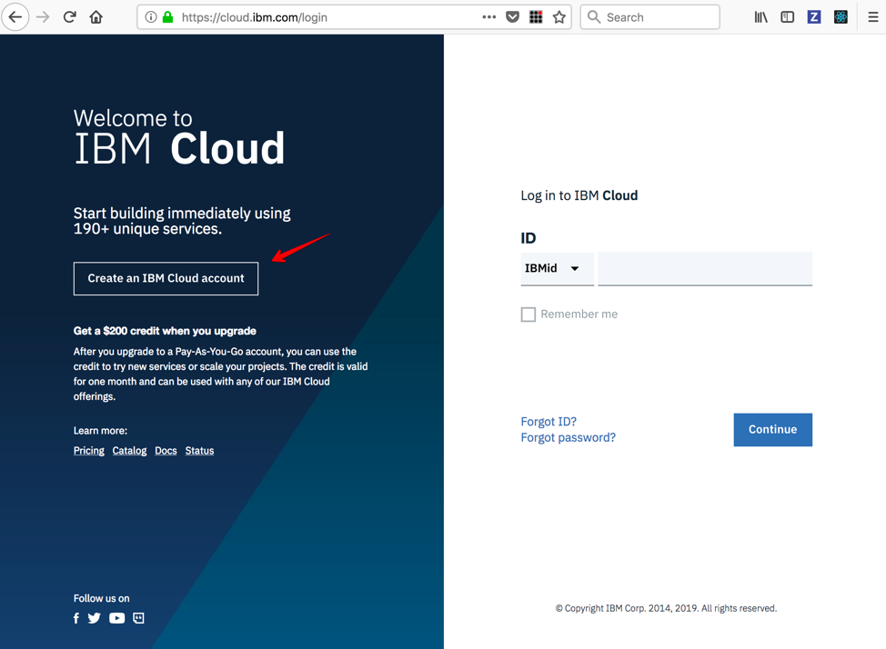


3.	On the registration page, under Create a free account, fill in the required info:

i.	Email

ii.	First Name

iii.      Last Name

iv.	Country or Region

v.	Password 
          
    (Note that: Password must contain 8-31 characters with at least one upper-case, one lower-case, one number. The characters ‘?’ and ‘}’ are not allowed.)

vi.	Contact method (Optional)
      
     Check off ‘by email’ or ‘by telephone’, both or none.


4.	Review the *IBM Privacy Statement* and *Terms and Conditions*

5.	Click the `Create Account` button


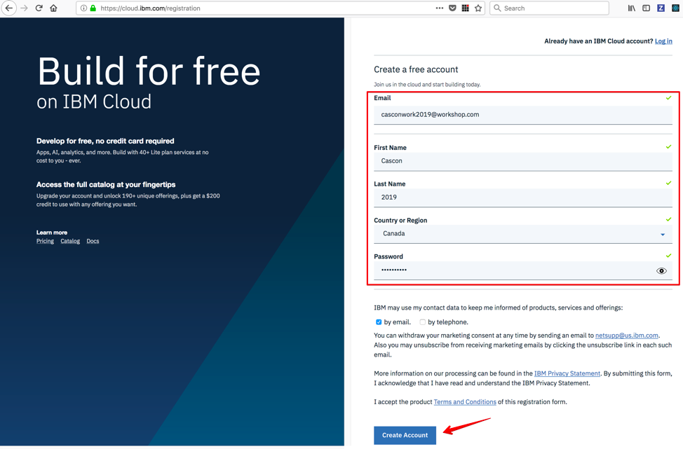


You will receive an email titled _*Action required: Confirm your IBM Cloud account*_ in your inbox.

Open the email and click on the `Confirm Account` button.


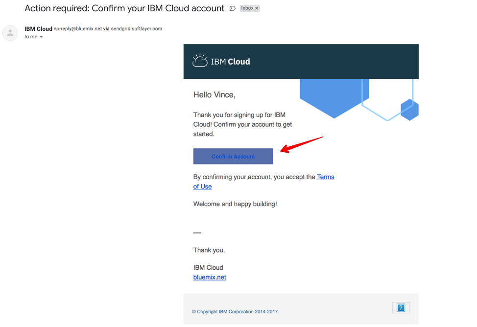


Upon confirming your account. You will see this welcome message indicating that your account is ready for use:


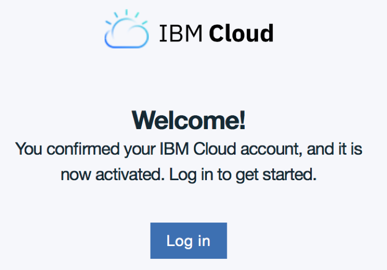


## Section 2 - Creating a Kubernetes Cluster

For this lab, we will be using the free Kubernetes cluster available to IBM Cloud free tier users.


1.	Go to https://cloud.ibm.com

2.	Log in to your IBM Cloud account

3.	Enter your IBM Cloud ID and click `Continue` button


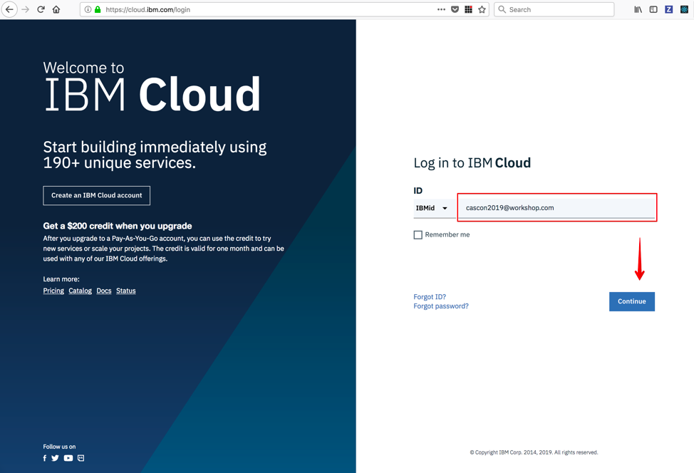

4.	Enter your Password then click the `Log in` button

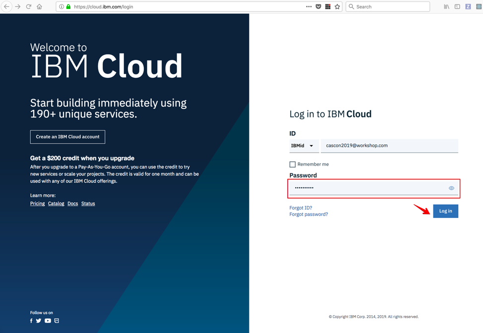


5.	Upon successful login, you will arrive on your *Dashboard* page.

6.	Click on the `Create resource` button on the top right corner.

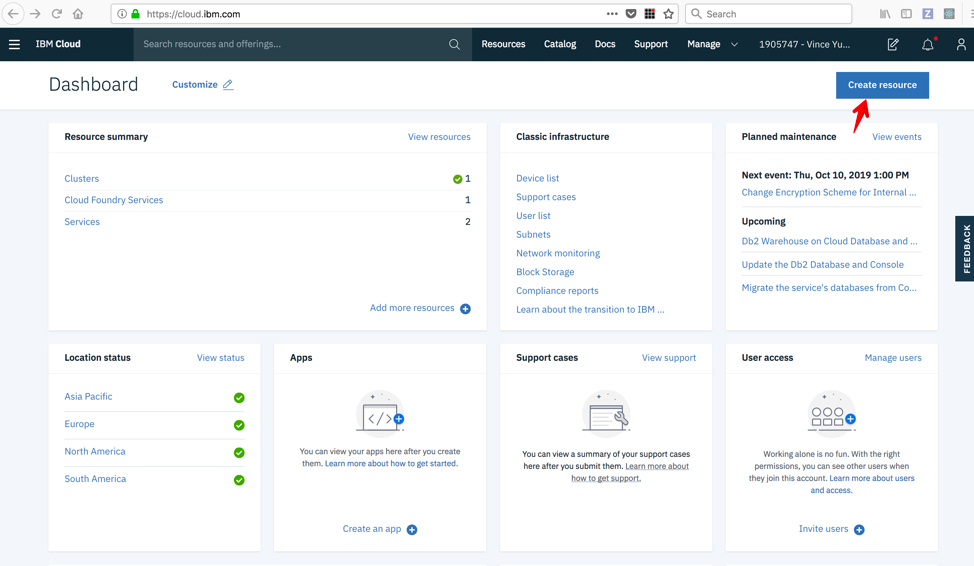


7.	On the *Catalog* page, click on the `Kubernetes Service` tile:

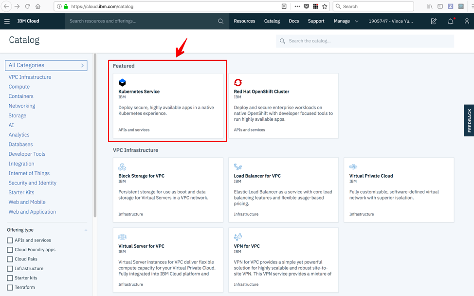


8.	On the *Kubernetes Service* page, click on the `Create` button:

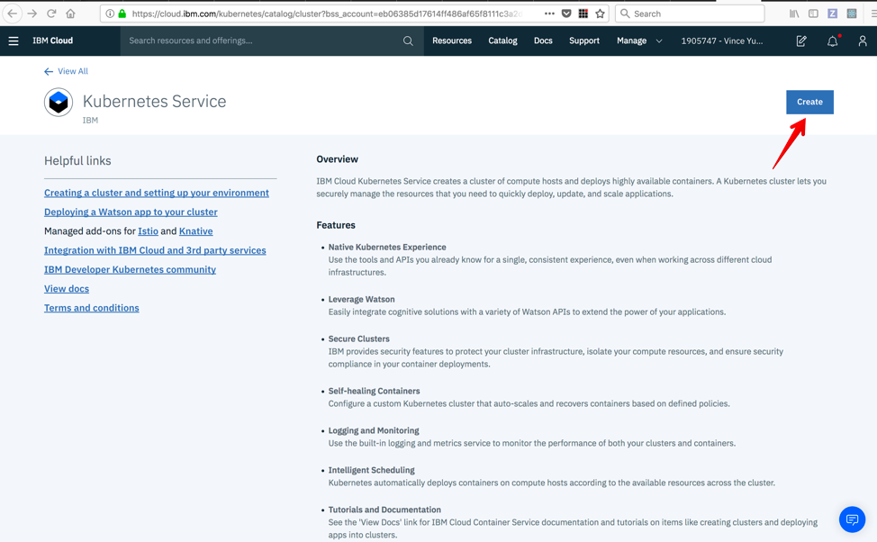

9.	On the *Create a new cluster* page, under *Select a plan*, click on the `Free` tile:


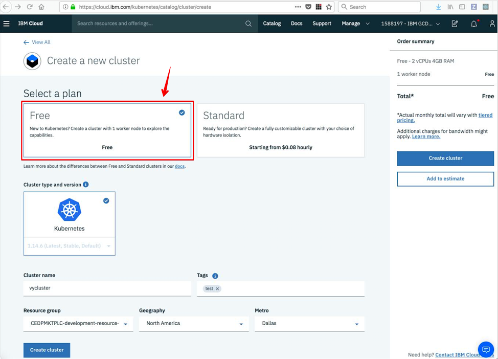

10.	`Kubernetes` is the preselected default Cluster type for the free plan, where the latest stable version is listed inside the tile (eg. V1.14.6).

11. Fill in the required info:

i. Cluster name

    Enter a name for your cluster
    
ii.	Tags
    
    Optionally, enter any tags for this cluster or leave blank

iii.	Resource group

    Select "Default" from the drop down

iv.	Geography

    Select "North America" from the drop down


v.	Metro

    Select "Dallas" from the drop down


12.	Click on the `Create cluster` button.


13.	You will see a green progress bar with status info:  *Requesting creation…*

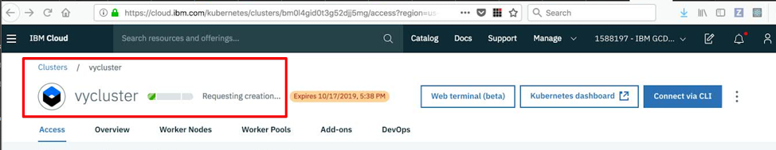


14.	The entire cluster creation process can take on average 20-45mins, or more, depending on your connection and network traffic.

15.	The green bar will keep progressing and there will be some time spent on *Configuring worker nodes…*


While you are waiting for the cluster provision to complete, you can move onto the next section 3 to set up the required Command Line Interface tools.


## Section 3 - Setting up CLI Tools


### 3.1 Installation

We will need to install the IBM Cloud CLI (Command Line Interface) and the Kubernetes Service and Container Registry plug-ins.

1.	Open a terminal or command line window.

For Mac and Linux, run:
    
          curl -sL https://ibm.biz/idt-installer |bash

        
For Windows 10, run this as an administrator:

```
[Net.ServicePointManager]::SecurityProtocol = "Tls12"; iex(New-Object  Net.WebClient).DownloadString('https://ibm.biz/idt-win-installer')
```

This will take a few mins to finish.

In addition to the above mentioned, this command will also install the Kubernetes CLI (kubectl) as well as other tooling:


```
homebrew (mac only)
git
docker
helm
curl (linux only)
IBM Cloud Developer Tools plug-in
IBM Cloud Functions plug-in
IBM Cloud Object Storage plug-in
```

### 3.2 Verify the installation

Next, you can verify your installation by attempting to login via the IBM Cloud CLI

1.	In your terminal type: 

        ibmcloud login

(Note: this may prompt to display an auth code in your default broswer. Type `Y`, login, then copy/paste the auth code into the terminal)

2.	Enter your Email address as prompted: 

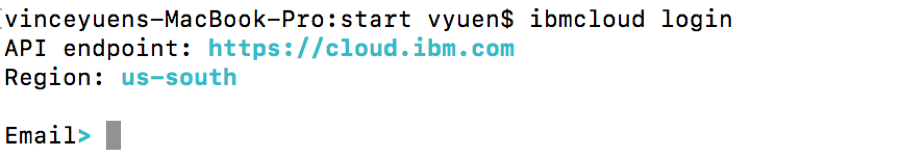


3.	Enter your Password as prompted:


4.	Once your login is successful, you will see an OK message with your account details


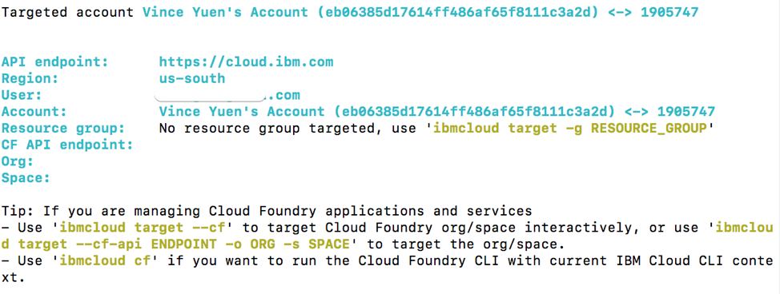


Next, verify the service plug-in are installed properly.

5.	In your terminal type: 

         ibmcloud plugin list


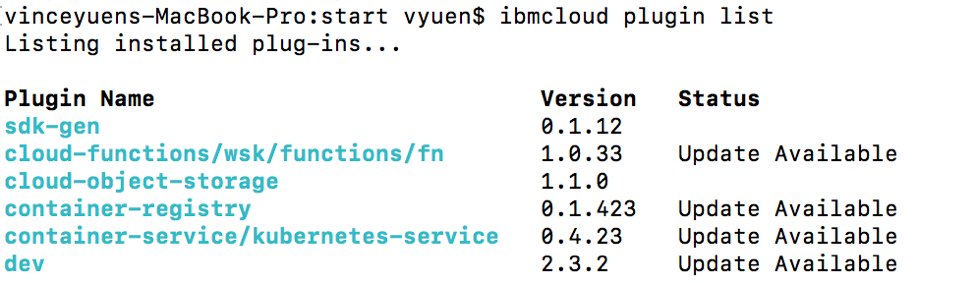


### 3.3 Set up KubeConfig

After your cluster is provisioned from Section 2, we can complete the kubeconfig set up.

1. Ensure you are logged in to your ibm account

```
ibmcloud login -a cloud.ibm.com -r us-south -g default

```

(Use -sso for federated account)


```
ibmcloud login -a cloud.ibm.com --sso -r us-south -g default

```

2. Download your cluster's kubeconfig files

```
ibmcloud ks cluster-config --cluster <cluster id>
```

where cluster id can be found on your cluster creation page, *eg. bm0l4gid0t3g52djj5mg*


3. Take the output from the previous command to set the _KUBECONFIG_ environment variable. For example:


```
export KUBECONFIG=/Users/vyuen/.bluemix/plugins/container-service/clusters/<cluster id>/kube-config-hou02-vycluster.yml
```
where cluster id can be found on your cluster creation page, *eg. bm0l4gid0t3g52djj5mg*


4. Verify that you can connect to your cluster:

```
kubectl version --short
```

You can also run the get pods command to ensure that it runs although we have no pods at this point:


```
kubectl get pods
```


## Section 4 - Other Tools

For windows users, ensure you have `gitbash` installed on your machine (https://gitforwindows.org)


Here's some recommended tools you can download and install ahead of time for working with the labs:

Visual Studio Code (https://code.visualstudio.com)  - Code editor

JQ (https://stedolan.github.io/jq/) - Command line JSON processor

Postman (https://www.getpostman.com) - API Client


