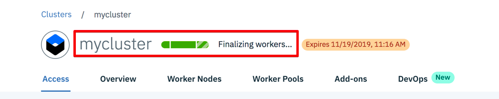

# Lab 1 Set Up & Prerequisites

This lab is a mandatory prerequisite for the subsequent labs (2-4) and must be completed prior to attending the workshop.


## Section 1 - Creating an account on IBM Cloud


Before you can carry on with the lab exercises, you first need to have an account on the IBM Cloud. If you already have an account, you can skip this step and proceed to section 2.

<details>
<summary>Instructions</summary>

1.	Go to https://cloud.ibm.com

2.	Click on the `Create an IBM Cloud account` button on the left side.


3.	On the registration page, under *Create a free account*, fill in the required info:

-	Email

-	First Name

-	Last Name

-	Country or Region

-	Password (must contain 8-31 characters with at least one upper-case, one lower-case, one number. The characters ‘?’ and ‘}’ are not allowed.)

-	Contact method (Optional - check off ‘by email’ or ‘by telephone’, both or none)


4.	Review the *IBM Privacy Statement* and *Terms and Conditions*.

5.	Click the `Create Account` button.


You will receive an email titled _*Action required: Confirm your IBM Cloud account*_ in your inbox.

6. Open the email and click on the `Confirm account` button.


7. Upon confirming your account. You will see this welcome message indicating that your account is ready for use:


</details>


## Section 2 - Creating a Kubernetes Cluster

For this lab, we will be using the free Kubernetes cluster available to IBM Cloud free tier users.


<details>
<summary>Instructions</summary>
    
1.	Go to https://cloud.ibm.com

2.	Log in to your IBM Cloud account.

3.	Enter your IBM Cloud ID and click `Continue` button.


4.	Enter your Password then click the `Log in` button.


5.	Upon successful login, you will arrive on your *Dashboard* page. 

i. Click `Next` through the intro overlay screens if they appear. Otherwise proceed to step 6.


ii. Click `Close` or the `X`.


6.	Click on the `Create resource` button on the top right corner.


7.	On the *Catalog* page, you may see that the default results are being filtered by "lite". If so, remove the *label:lite* filter from the search box:


8.	This should bring up the Featured results on top, click on the `Kubernetes Service` tile:


9.	On the *Kubernetes Service* page, 

A. If you see this message near the bottom :

```
Kubernetes clusters are not available with your current account type. 
Upgrade your account to create a cluster.
```   


i.	You would first have to upgrade your account. Scroll down on this page to see the various price plans that IBM offers.

ii.	For the purpose of this lab, we will use the *Free* plan, which gives us a free cluster with 1 worker node. Click the `Upgrade` button.


iii.	On the *Unlock the full catalog* overlay, fill out the requested information to upgrade to your account to a *Pay-as-you-go* account. 


### Note: Although this step requires you to enter your Credit Card Information, you *__will not be charged__* if you are only using free services for the purpose of this workshop.


iv. Select the *Personal Account* radio. Fill out the required Billing Information (First name, Last name, Address, Phone Number):


v. Fill out the required Credit Card Information (Credit Card Number, Expiration Date, Security Code). Select a Payment Currency. Click the "I accept" checkbox after reading the *Cloud Services terms*. Click `Next`.


vi. It may take a couple minutes to process the upgrade. When completed, this screen will appear. Click `Done` and proceed to step 11.


    

B. Otherwise, your account is already eligible to create the free cluster. 


10. On the *Kubernetes Service* page, click on the `Create` button:


11.	On the *Create a new cluster* page, under *Select a plan*, click on the `Free` tile:


12.	`Kubernetes` is the preselected default Cluster type for the free plan, where the latest stable version is listed inside the tile (eg. V1.14.7). At this point, if you do not see the following fields, you may need to refresh your page (eg. if you are just coming from step 9vi). 

Fill in the required info:

i.        Cluster name

    Enter a name for your cluster, eg. 'mycluster'

ii.	Resource group

    Select "Default" from the drop down


13.	Review the *Order summary*. A free cluster with 2 vCPUs 4GB RAM and 1 worker node will be created. Click on the `Create cluster` button.


14.	On your *Cluster* page, the cluster creation process is indicated by a green progress bar with status info: eg.  *Requesting creation…*  


Then *Preparing master,workers…*


15.	The entire cluster creation process can take on average 20-45mins, or more, depending on your connection and network traffic.

As the green bar progresses,  there will be some time spent on *Configuring worker nodes…* and *Finalizing workers…* This is expected.




While you are waiting for the cluster provision to complete, you can move on to Section 3 to set up the required Command Line Interface tools.


16.	Once the cluster has been successfully provisioned, you will see a green `Normal` status replacing the previous progress bar:


</details>


## Section 3 - Setting up CLI Tools

### 3.1 Installation

We will need to install the IBM Cloud CLI (Command Line Interface) and the Kubernetes Service and Container Registry plug-ins.

<details>
<summary>Instructions</summary>

1.	Open a terminal or command line window.

For Mac and Linux, run:
    
          curl -sL https://ibm.biz/idt-installer |bash

        
For Windows 10, run this as an administrator in Windows Powershell:

```
[Net.ServicePointManager]::SecurityProtocol = "Tls12"; iex(New-Object  Net.WebClient).DownloadString('https://ibm.biz/idt-win-installer')
```

This will take a few mins to finish. If you've already got these installed previously, it will upgrade your existing plug-ins to the latest versions.

**Note:** On Windows, the Docker for Windows installation may log you off, but the install is not completed. When you log in again, relaunch the same command again and the installation will resume. The installation will end with a question to ask for a system restart which you must complete.

In addition to the above mentioned, this command will also install the __Kubernetes CLI (kubectl)__ as well as other tooling:


```
homebrew (mac only)
git
docker
helm
curl (linux only)
IBM Cloud Developer Tools plug-in
IBM Cloud Functions plug-in
IBM Cloud Object Storage plug-in
```

**Note:** On Windows this will include gitbash which is the command line tool that you should use for the rest of the labs as the commands for Mac and Linux will work in gitbash.


2. Upon completion, you will see the _Install finished._ message :


</details>


### 3.2 Verify the installation

Next, verify your installation by following the steps below.


<details>
<summary>Instructions</summary>
    
First, let's attempt to login via the IBM Cloud CLI.

1.	In your terminal, type: 

        ibmcloud login -a cloud.ibm.com -r us-south -g Default
        
        
(Use --sso for federated account:)

        ibmcloud login -a cloud.ibm.com --sso -r us-south -g Default


(Note: this may prompt to display an auth code in your default broswer. Type `Y`, login, then copy/paste the auth code into the terminal)

2.	Enter your Email address as prompted: 


3.	Enter your Password as prompted:


4.	Once your login is successful, you will see an OK message with your account details:


Next, verify that service plug-in are installed properly.

5.	In your terminal type: 

         ibmcloud plugin list


</details>


### 3.3 Set up KubeConfig

After your cluster is provisioned from Section 2, we can now complete the kubeconfig set up.

<details>
<summary>Instructions</summary>

1. Ensure you are logged in to your ibm cloud account. If you have just completed section 3.2, you can skip logging in again and proceed directly to step 2.

```
ibmcloud login -a cloud.ibm.com -r us-south -g Default

```

(Use --sso for federated account)


```
ibmcloud login -a cloud.ibm.com --sso -r us-south -g Default

```

2. Next, download your cluster's kubeconfig files. On the command line, type:

```
ibmcloud ks cluster-config --cluster <cluster_id>
```

where `<cluster_id>` can be found on your cluster creation page from section 2 step 16, *eg. bmm8gi4d0d78en43d430*


3. Next we set the _KUBECONFIG_ environment variable. Copy the output from the previous step then paste this in the command window to execute. For example:

```
export KUBECONFIG=/Users/<user>/.bluemix/plugins/container-service/clusters/<cluster_id>/kube-config-hou02-mycluster.yml
```

where `<user>` is the user profile on your machine
and `<cluster_id>` can be found on your cluster creation page, or from the previous step *eg. bmm8gi4d0d78en43d430*


4. Verify that you can connect to your cluster:

```
kubectl version --short
```


__Note:__ the recommended default versions above.


You can also run the get pods command to ensure that it runs although we have no pods at this point:


```
kubectl get pods
```

</details>

## Section 4 - Install Calico CLI

The IBM Cloud Kubernetes Service cluster is pre-installed with a network plugin called Calico.  Calico allows administrators to set up custom network policies in the Cluster.  In order to administer the Calico policies from a remote computer you first need to install the Calico Command Line Interface.

Go to the following URL and follow the instructions to install Calico CLI

https://cloud.ibm.com/docs/containers?topic=containers-network_policies#cli_install

Ensure that steps 1-6 on the above page are completed.

## Section 5 - Other Tools

Here's some recommended tools you can download and install ahead of time for working with the labs:

Visual Studio Code (https://code.visualstudio.com)  - Code editor

JQ (https://stedolan.github.io/jq/) - Command line JSON processor

Postman (https://www.getpostman.com) - API Client


## Continue

Continue to [Lab 2](https://github.com/cloud-coder/cascon-2019-kubernetes-apimanager/tree/master/02-kubernetes-service-creation)
