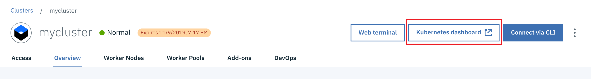

# ***DRAFT***
# 3. Scaling Microservices in Kubernetes
In this lab, learn how to scale a microservice running in Kubernetes using replicas and how to safely roll up an update to the number of replicas.

Deployments in Kubernetes can be horizontally scaled using replicas. A replica is a copy of a pod that contains a running service. To scale your Kubernetes application horizontally, create multiple replicas which ensure that multiple running copies of your application are available to handled increased workloads.  

You can scale your Kubernetes application running on the IBM Cloud Kubernetes service by specifying the number of replicas by:

* Running the ```kubectl scale``` command
* Using a deployment configuration file
* Navigating to the deployments view in the IBM Cloud Kubernetes service dashboard and modifying the configuration

## Horizontal Scaling with Replicas
1. Scaling account, provider and cost service deployments  
In this step you will scale the account deployment by adding 2 replicas, the provider depolment with 4 replicas and the cost deployment with 8 replicas.  

1.1. Scale the dep-account depolyment by adding 2 replicas ***using the kubectl scale command*** by running  
```
$ kubectl scale --replicas=2 deployment dep-account  
deployment "dep-account" scaled 
```
  
Kubernetes will now add 2 new pods for the dep-account service. You can verify this by running the ``` kubectl get pods``` command. Notice that 2 new pods for the dep-account were created. Now try deleting one of the account pods using the command ```kubectl delete pods dep-account-xxx```. Kubernetes will delete the pod and re-create a new one to satisfy the deployment configuration that specified 2 replicas for the deployment, dep-account. You can verify this by running the ``` kubectl get pods``` command and notice the name of the newly created dep-account-xxx pod.


1.2.  Scale the dep-provider depolyment by adding 4 replicas by ***editing the deployment configuration*** running the command below and modifying the *replicas* property value under the spec property. You can also edit the deployment configuration via the Kubernetes dashboard.
 
``` 
kubectl edit deployment/dep-provider
```

```
# Please edit the object below. Lines beginning with a '#' will be ignored,
# and an empty file will abort the edit. If an error occurs while saving this file will be
# reopened with the relevant failures.
#
apiVersion: extensions/v1beta1
kind: Deployment
metadata:
  annotations:
    deployment.kubernetes.io/revision: "1"
  creationTimestamp: 2019-09-28T13:37:57Z
  generation: 1
  labels:
    app: dep-provider
  name: dep-provider
  namespace: default
  resourceVersion: "299245"
  selfLink: /apis/extensions/v1beta1/namespaces/default/deployments/dep-provider
  uid: 2e86236f-e1f5-11e9-86a5-022c994165ef
spec:
  progressDeadlineSeconds: 2147483647
  replicas: 4
  revisionHistoryLimit: 2147483647
...
```  
Save changes and exit edit mode. Verify that 4 new provider service pods were created by running the command ``` kubectl get pods```.  


1.3. To scale the dep-cost service by adding 8 replicas via the ***IBM Cloud Kubernetes Dashboard***, launch the dashboard from your Kubernetes service cluster and navigate to Deployments view. 
  


Click on the Scale menu option against the dep-cost service and add 8 replicas. 
  


2. We will then proceed to rollout the changes. To roll out these change run
```
kubectl rollout status deployment/dep-account
kubectl rollout status deployment/dep-provider
kubectl rollout status deployment/dep-cost
```
*The rollout might occur so quickly that the following messages might not display:*
```
Waiting for rollout to finish: 1 of 2 updated replicas are available...
Waiting for rollout to finish: 2 of 2 updated replicas are available...
deployment "dep-account" successfully rolled out
...
...
```
You may see the output as each pod for each service is being rolled out.  

3. Once the rollout has finished, verify that the replicas have been rolled out and are runnig. To do this run the command:
```
kubectl get pods

NAME                                    READY     STATUS    RESTARTS   AGE
dep-account-b78dfd57d-cpjp7             1/1       Running   0          36m
dep-account-b78dfd57d-dbt9d             1/1       Running   0          18h
dep-cost-5dcd9b5c7f-kppcj        1/1       Running   0          23h
dep-cost-5dcd9b5c7f-lv5tw        1/1       Running   0          8m
dep-cost-5dcd9b5c7f-kaccj        1/1       Running   0          21h
dep-cost-5dcd9b5c7f-de5tw        1/1       Running   0          12m
dep-cost-5dcd9b5c7f-werft        1/1       Running   0          13h
dep-cost-5dcd9b5c7f-ppiuo        1/1       Running   0          19m
dep-cost-5dcd9b5c7f-yuabj        1/1       Running   0          20h
dep-cost-5dcd9b5c7f-sinae        1/1       Running   0          11m
dep-provider-6c897669cb-fzzsc           1/1       Running   0          23h
dep-provider-6c897669cb-jfjbz           1/1       Running   0          7m
dep-provider-6c897669cb-lcbbg           1/1       Running   0          7m
dep-provider-6c897669cb-cdfgy           1/1       Running   0          9m

```
  
4. A ReplicaSet is a Kubernetes object whose purpose is to maintain a stable set of replicated Pods running at any given time. Kubernetes should have craeted 2 replicasets for the pods running the account service, 8 for the cost service and 4 for the provider. To view the ReplicaSets and the number of replicas that were created after scaling run:
```
kubectl get replicasets
```
```
NAME                              DESIRED   CURRENT   READY     AGE
dep-account-b78dfd57d             2         2         2         18h
dep-cost-5dcd9b5c7f               8         8         8         23h
dep-provider-6c897669cb           4         4         4         23h
```
  
5. Now let's go back to the browser and verify the number of pods that were created by navigating once again to the Kubernetes dashboard.  Click "Kubernetes Dashboard" button on your IBM Cloud Kubernetes cluster page as before. This action would launch the Kubernetes dashboard. Navigate to the Workloads tab on the dashboard. Notice the number of pods currently running for each of the services.  You can see the status of all of the pods running (green checkmarks). There are now 14 instances of the app running in this deployment.  


  
6. Use curl or browser to hit the URL Of your app again, from step 8 of the last section (eg. http://173.193.112.134:32761), you should see your app being served by the different pods each time you hit it:  


### Note
Other ways to improve availability is to [add more clusters and nodes that expand across geo regions](https://cloud.ibm.com/docs/containers?topic=containers-clusters). You can set up a worker pool with multiple nodes in multiple zones, thereby increasing the number of total workers. This is unfortunately out of scope of this workshop (requires paid account).
