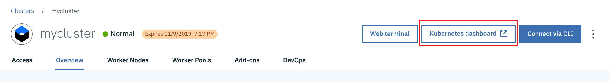
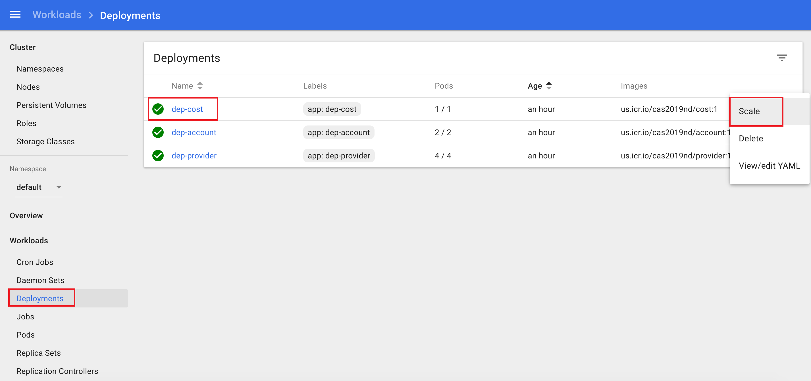
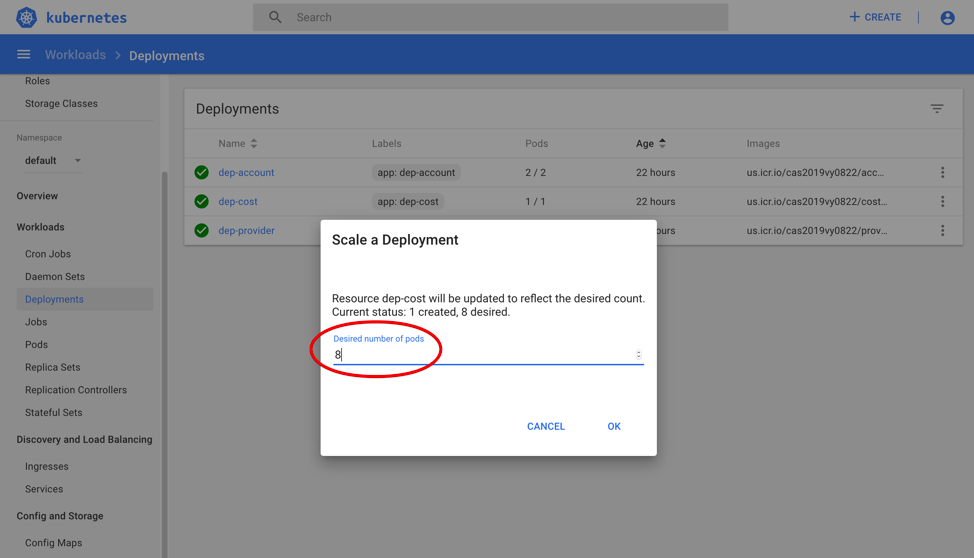
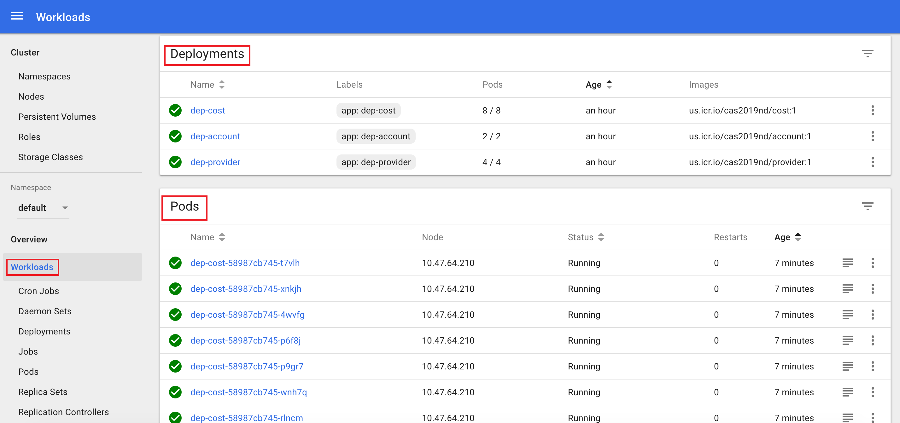

# Lab 3 Scaling Microservices in Kubernetes
In this lab, learn how to scale a microservice running in Kubernetes using replicas and how to safely roll up an update to the number of replicas.

Deployments in Kubernetes can be horizontally scaled using replicas. A replica is a copy of a pod that contains a running service. To scale your Kubernetes application horizontally, create multiple replicas which ensure that multiple running copies of your application are available to handle increased workloads.  

## Manual Scaling with Replicas

By default when a deployment is created, a single pod is created.  The deployment has a *replicaset* resource which manages the fact that a running single pod is needed.  If the pod is terminated, the replicaset is responsible for trying to bring up another pod, and continues to do this forever.  The replicaset can be configured to specify multiple pods in order to handle greater loads (eg. more requests).  This is known as Horizontal Scaling.

  
You can scale your Kubernetes application running on the IBM Cloud Kubernetes service by specifying the number of replicas via:

  * Running the ```kubectl scale``` command
  * Using a deployment configuration file
  * Navigating to the deployments view in the IBM Cloud Kubernetes service dashboard and modifying the configuration


Let's go ahead and scale the *account*, *provider* and *cost* service deployments.


<details>
<summary>Instructions</summary>
  
  

1. In this step you will scale the *account* deployment by adding 2 replicas, the *provider* deploment with 4 replicas and the *cost* deployment with 8 replicas


<details>
<summary>1.1. Scale the dep-account deployment by adding 2 replicas using the kubectl scale command </summary>
  

Note: If you modified the Kubernetes namespace in the last lab, you need to first set it back to the default namespace by executing the following command:

```
kubectl config set-context --current --namespace=default
```

i. Now scale the account deployment. Run:

```
kubectl scale --replicas=2 deployment dep-account  
```

You should see `deployment "dep-account"scaled`.

  
ii. Kubernetes will now add 2 new pods for the dep-account service. Verify this by running the command


```
kubectl get pods
```


Notice that 2 new pods for the dep-account got created. 


iii. Now let's try deleting one of the account pods. 

```
kubectl delete pods dep-account-xxx
```


iv. Kubernetes will delete the pod and re-create a new one to satisfy the deployment configuration that specified 2 replicas for the deployment, dep-account. Verify this by running


```
kubectl get pods
``` 


Notice the name of the newly created dep-account-xxx pod.

</details>

Scaling on the command line is a quick way to add additional pods but perhaps it is not the best way because the modification of the deployment is only temporary.  Ideally you'd likely want to have this done permanently. This can be achieved by updating the number of replicas in the deployment configuration file.

 


<details>
<summary>1.2.  Scale the dep-provider deployment to 4 replicas by editing the deployment configuration</summary>
  
  

i. Run the command below to edit the deployment configuration. Alternatively, you can edit the deployment configuration via the Kubernetes dashboard.
 
``` 
kubectl edit deployment/dep-provider
```


ii. Modify the *replicas* property value under the *spec* property.

```
# Please edit the object below. Lines beginning with a '#' will be ignored,
# and an empty file will abort the edit. If an error occurs while saving this file will be
# reopened with the relevant failures.
#
apiVersion: extensions/v1beta1
kind: Deployment
metadata:
  annotations:
    deployment.kubernetes.io/revision: "1"
  creationTimestamp: 2019-09-28T13:37:57Z
  generation: 1
  labels:
    app: dep-provider
  name: dep-provider
  namespace: default
  resourceVersion: "299245"
  selfLink: /apis/extensions/v1beta1/namespaces/default/deployments/dep-provider
  uid: 2e86236f-e1f5-11e9-86a5-022c994165ef
spec:
  progressDeadlineSeconds: 2147483647
  replicas: 4
  revisionHistoryLimit: 2147483647
...
```  
iii. Save changes and exit edit mode. 


iv. Verify that 4 new provider service pods were created

```
kubectl get pods
```

</details>


<details>
<summary>1.3. Scale the dep-cost service to 8 replicas via the IBM Cloud Kubernetes Dashboard</summary>
  
  

i. Launch the dashboard from your Kubernetes service cluster and navigate to the Deployments view. 
  


ii. Click on the icon on the right of the dep-cost service to display the options menu. Select `Scale`.

  


iii. Enter 8 in the *Scale a Deployment* dialog and click `Ok`.

  


</details>


2. Next let's proceed to view the rollout status. 


i. Run

```
kubectl rollout status deployment/dep-account
kubectl rollout status deployment/dep-provider
kubectl rollout status deployment/dep-cost
```

You may see the output as each pod for each service is being rolled out:

eg. for dep-accout:
```
Waiting for rollout to finish: 1 of 2 updated replicas are available...
Waiting for rollout to finish: 2 of 2 updated replicas are available...
deployment "dep-account" successfully rolled out
...
```

eg. for dep-cost:
```
Waiting for deployment "dep-cost" rollout to finish: 1 of 8 updated replicas are available...
Waiting for deployment "dep-cost" rollout to finish: 2 of 8 updated replicas are available...
Waiting for deployment "dep-cost" rollout to finish: 3 of 8 updated replicas are available...
Waiting for deployment "dep-cost" rollout to finish: 4 of 8 updated replicas are available...
Waiting for deployment "dep-cost" rollout to finish: 5 of 8 updated replicas are available...
Waiting for deployment "dep-cost" rollout to finish: 6 of 8 updated replicas are available...
Waiting for deployment "dep-cost" rollout to finish: 7 of 8 updated replicas are available...
deployment "dep-cost" successfully rolled out
...
```


3. Once the rollout has finished, verify that the replicas have been rolled out and are running. 

i. To do this, run

```
kubectl get pods
```

You should see the following output for all the replicas that we have scaled:

```
NAME                            READY   STATUS    RESTARTS   AGE
dep-account-6576b6f45f-8cnl8    1/1     Running   0          55m
dep-account-6576b6f45f-hlw7c    1/1     Running   0          22h
dep-cost-7fbc9cf878-5fjkq       1/1     Running   0          3m25s
dep-cost-7fbc9cf878-6bj84       1/1     Running   0          22h
dep-cost-7fbc9cf878-7wc87       1/1     Running   0          3m25s
dep-cost-7fbc9cf878-bnrqz       1/1     Running   0          3m25s
dep-cost-7fbc9cf878-fmwgh       1/1     Running   0          3m25s
dep-cost-7fbc9cf878-qrxgp       1/1     Running   0          3m25s
dep-cost-7fbc9cf878-ttmps       1/1     Running   0          3m25s
dep-cost-7fbc9cf878-vtsqp       1/1     Running   0          3m25s
dep-provider-777f4d7b4b-d7fc2   1/1     Running   0          22h
dep-provider-777f4d7b4b-mhmvd   1/1     Running   0          23m
dep-provider-777f4d7b4b-sggcn   1/1     Running   0          23m
dep-provider-777f4d7b4b-t7t5b   1/1     Running   0          23m

```
  
4. As mentioned, a **replicaset** is a Kubernetes object whose purpose is to maintain a stable set of replicated Pods running at any given time. Kubernetes should have created 2 replicasets for the pods running the account service, 8 for the cost service and 4 for the provider.

i. To view the replicasets and the number of replicas that were created after scaling run:

```
kubectl get replicasets
```

You should see the list of replicasets:
```
NAME                              DESIRED   CURRENT   READY     AGE
dep-account-b78dfd57d             2         2         2         18h
dep-cost-5dcd9b5c7f               8         8         8         23h
dep-provider-6c897669cb           4         4         4         23h
```
  
5. Now let's go back to the browser and verify the number of pods that were created by navigating once again to the Kubernetes dashboard.  

i. Click "Kubernetes Dashboard" button on your IBM Cloud Kubernetes cluster page as before. This action would launch the Kubernetes dashboard. 

ii. Navigate to the Workloads tab on the dashboard. Notice the number of pods currently running for each of the services.  You can see the status of all of the pods running (green checkmarks). There are now 14 instances of the app running in this deployment.  



  
6. Test any of services that were created using either cURL or from your browser.

```
eg. http://<external ip>:<account service port>/account
eg. http://<external ip>:<account service port>/account/123
eg. http://<external ip>:<provider service port>/provider
eg. http://<external ip>:<provider service port>/provider/bell
eg. http://<external ip>:<cost service port>/cost
eg. http://<external ip>:<cost service port>/cost/123
```

Notice that each time you hit the same service, the service request might be handled by a different pod running the service. This can be verified by checking the hostname from the service response. The external IP address and port remain the same but based on load, the requests may end up on different pods.

Just as you scaled up the number of replicas, you can even scale them down.  

</details>


## AutoScaling with Replicas

What we have seen is that the Kubernetes administrator can update the replicas if they suspect that there are insufficient pods to handle all the requests.  However in practice, this relies on someone to scale up or down when
needed, and may cause an overuse of resources, as well as a maintenance headache when dealing with many different pods.

<details>
<summary>Instructions</summary>

In order for Kubernetes to make the most efficient use of resources, it must understand the resource needs for your pods so that it will know when scaling should occur.  These fields can be updated in your pod definition
to provide this information, resources and limits.  

| Field | Description |
|-------| --- |
| Requests - cpu | Requests describes the minimum amount of cpu required. |
| Requests - memory | Requests describes the minimum amount of memory required. |
| Limits - cpu | Limits describes the maximum amount of cpu allowed. | 
| Limits - memory | Limits describes the maximum amount of memory allowed. | 

The cpu is measured in cores, so 100m would be equivalent to 0.1 core.  

1. To check how many cpu cores and memory we have, you can check the nodes in your cluster:

    ```
    kubectl get nodes -o=jsonpath='{.items[0].status.capacity}'
    ```

    map[cpu:2 ephemeral-storage:101330012Ki hugepages-1Gi:0 hugepages-2Mi:0 memory:4041540Ki pods:110]

This output shows there are 2 CPU cores, and a total of 4Gb of memory available to us.

2. Let us create a different deployment from a different image which has an initial request of 0.5 of a core, and 256 Mb of memory, and display how much cpu is in use currently.

    ```
    kubectl run resource-consumer --image=gcr.io/kubernetes-e2e-test-images/resource-consumer:1.4 --expose --service-overrides='{ "spec": { "type": "NodePort" } }' --port 8080 --requests='cpu=500m,memory=256Mi'
    ```

3. Create a Horizonal Pod Autoscaler

    ```
    kubectl autoscale deploy resource-consumer --min=1 --max=10 --cpu-percent=5
    kubectl get horizontalpodautoscaler
    kubectl get hpa
    ```

It may take some time for the autoscaler to calculate cpu usage for the resource-consumer.  It should appear similar to this:

    NAME                REFERENCE                      TARGETS   MINPODS   MAXPODS   REPLICAS   AGE
    resource-consumer   Deployment/resource-consumer   0%/5%     1         10        1          39s

i.  The resource-consumer deployment also has a service created with a nodeport.  Examine it and note the external port:

 ```
kubectl get service resource-consumer
```

ii. This resource-consumer image allows us to simulate load 

```
curl --data "millicores=600&durationSec=60" http://<EXTERNAL-IP>:<SERVICE_PORT>/ConsumeCPU
```

iii. After a few moments, you can check how many resource-consumer pods there are, and how much cpu is being consumed.

```
kubectl get hpa
kubectl top pods
```

```
NAME                REFERENCE                      TARGETS   MINPODS   MAXPODS   REPLICAS   AGE
resource-consumer   Deployment/resource-consumer   54%/5%    1         10        4          4m49s
```

In our example, there are now a total of 4 replicas.  You may see many more resource-consumer pods being instantiated, but stuck in Pending State.  This is because of the initial requested cpu of the pod (0.5 core) cannot be allocated, because we only have 2 CPU cores to share amongst all pods.


4. Finally, lets clean up.

```
kubectl delete hpa resource-consumer
kubectl delete deployment resource-consumer
kubectl delete svc resource-consumer
```

</details>

## Further Investigation
Other ways to improve availability is to [add more clusters and nodes that expand across geo regions](https://cloud.ibm.com/docs/containers?topic=containers-clusters). You can set up a worker pool with 
multiple nodes in multiple zones, thereby increasing the number of total workers. This is unfortunately out of scope of this workshop (requires paid account).

## Continue

Continue to [Lab 4](https://github.com/cloud-coder/cascon-2019-kubernetes-apimanager/tree/master/04-api-management).

