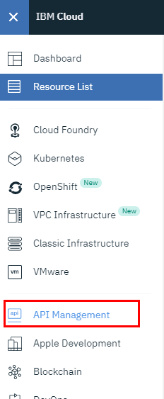
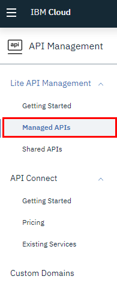
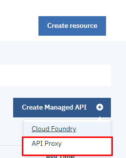
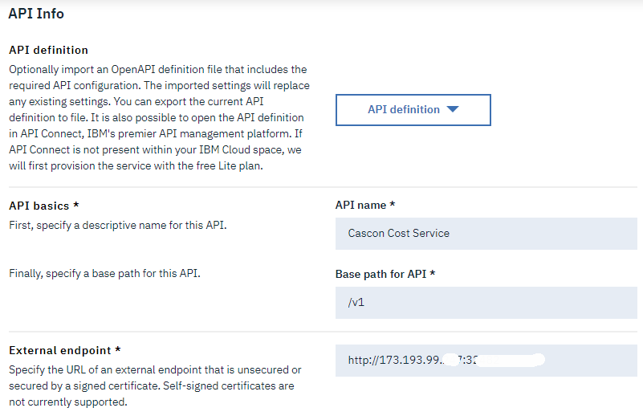
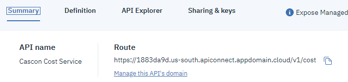

## API Management

So far, we have created services, deployed them to a kubernetes cluster and we have exposed one of these services via a NodePort which assigns a random port to the service.

In this part of the workshop, we will use the IBM Cloud API Management to start securing our service so that we can eventually control who has access and impose API limits to the calls to our service.

### Pre-requisites

In order to be able to configure API management you will need some pieces of information about your cluster. Run the two commands below.

```
kubectl get nodes -o wide
kubectl get services -o wide
```

The first one will allow you to find your External IP address for your cluster.

The second will allow you to see which port your NodePort is configured for,

Sample output: 
```
$ kubectl get nodes -o wide
NAME            STATUS   ROLES    AGE   VERSION       INTERNAL-IP     EXTERNAL-IP      OS-IMAGE             KERNEL-VERSION      CONTAINER-RUNTIME
10.80.171.159   Ready    <none>   15d   v1.14.6+IKS   10.80.171.159   173.197.99.247   Ubuntu 16.04.6 LTS   4.4.0-161-generic   containerd://1.2.9

$ kubectl get services -o wide
NAME                  TYPE        CLUSTER-IP       EXTERNAL-IP   PORT(S)          AGE     SELECTOR
account-service       ClusterIP   172.25.28.46     <none>        8080/TCP         4d18h   app=dep-account
kubernetes            ClusterIP   172.25.0.1       <none>        443/TCP          15d     <none>
monthlycost-service   NodePort    172.25.126.195   <none>        8080:32482/TCP   4d18h   app=dep-monthlycost
provider-service      ClusterIP   172.25.240.212   <none>        8080/TCP         4d18h   app=dep-provider

```

So for our example:
- External IP: 173.197.99.247
- Port: 32482

### Testing our service using curl

We should be able to access our service using *curl* (or Postman)
```
curl http://173.197.99.247:32482
```

Sample output:
```
$ curl http://173.197.99.247:32482
  % Total    % Received % Xferd  Average Speed   Time    Time     Time  Current
                                 Dload  Upload   Total   Spent    Left  Speed
100   166  100   166    0     0   1185      0 --:--:-- --:--:-- --:--:--  1185Private MonthlyCost Application<br/>I am hostname: dep-monthlycost-69fc59959c-fbg8w<br/>Your app is up and running in a cluster!<br/>No Accounts<br/>No Providers<br/>

```

### Accessing API management

In your IBM Cloud account, 
- Top left menu, then select *API Management*

- Then in the left menu select *Managed APIs*

- On the right click the blue button *Create Managed API* and select the *API Proxy* option


### Creating your first API proxy

The page that comes up allows you to create an API proxy. The simplest way to achive this is by filling in the information for
- API Name, this is just a user firendly name to identify the API
- Base path for API, this is what you want. Often a version is used, for example `/v1`
- External endpoint, this will be the public IP of your kubernetes cluster with the port used by your NodePort


With those pieces of information filled in, scroll to the bottom and click the blue *Create* button.

If you go on the *Summary* tab, you will see the Route you have just created.


In our case the route is `https://1883da9e.us-south.apiconnect.appdomain.cloud/v1`

You should now be able to test the new end point:
```
curl https://1883da9e.us-south.apiconnect.appdomain.cloud/v1
```

```
$ curl https://1883da9e.us-south.apiconnect.appdomain.cloud/v1
  % Total    % Received % Xferd  Average Speed   Time    Time     Time  Current
                                 Dload  Upload   Total   Spent    Left  Speed
100   166  100   166    0     0    322      0 --:--:-- --:--:-- --:--:--   322Private MonthlyCost Application<br/>I am hostname: dep-monthlycost-69fc59959c-fbg8w<br/>Your app is up and running in a cluster!<br/>No Accounts<br/>No Providers<br/>

```


Is our API secure? Well.... Not really.

If you run the following command

`curl http://173.193.99.247:32482`

You can still access the API.

We need to secure cluster network access, which we will do in *04b-securing-with-calico*