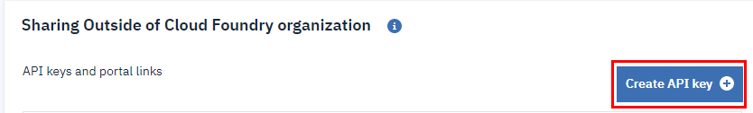

# Improving API Management Security

So we now have a microservice that is accessible only via the API management url. We can now turn our focus to improving the security of the API.

## Enabling Security using API Keys

Now that our API is accessible via the API Management, we can start enabling some of the security features included.

- Go to the *Definition" tab for the API in API Management
- Scroll to *Security and Rate Limiting*
- On the right, enable the *Require applications to authenticate via API key* option
    - Method: API key only
    - Location of API key and secret: Header
    - Parameter name of API key: X-IBM-Client-Id
- Scroll to the bottom and click *Save*

Back in the terminal if you re-run the curl command for the service you will get an authorization error.  Example:
```
curl https://1883da9d.us-south.apiconnect.appdomain.cloud/v1/cost/123
{"status":401,"message":"Error: Unauthorized"}
```

### Creating an API Key

In order to be able to access our API, we now need to create an API Key and start using it.

- In the API Managmement screen for the specific Cost API select the *Sharing & keys* tab
- In the *Sharing Outside of Cloud Foundry organization* section, click the blue button *Create API key*
    - Descriptive name: First API Key
    - API key: *Use generated key*

- Click the blue *Create* button


### Calling the API using the API Key

You now have an API key that you can use when calling the service. As per the configurations selected in previous steps, this API key needs to be added to the header

The curl command would look something like: 

`curl https://1883da9e.us-south.apiconnect.appdomain.cloud/v1/cost -H "X-IBM-Client-Id: <API_KEY>"`

Great! our API call worked!
- 

The Lite API Management feature in IBM Cloud allows up to 5 keys to be added per API.  These could be used to offer integration access to your API to different users or applications.

### Discussion on API Key and Secret

A secret is similar to a key, as is used to maintain access to the API itself. A secret is customizable and can be changed without changing the key. There cannot be a secret if there is no key. For example, only someone with the correct secret can upload a new version of the API. You can require an API and a secret for your API calls or only use a key. Secrets can be helpful if you need to change the secret, but do not want to change the key.

From: https://cloud.ibm.com/docs/services/api-management?topic=api-management-manage_apis


## Rate Limiting

Depending on your specific use case, you may need to limit the number of calls coming through to your API.
- Your clients only paid for a specific number of calls per period of time
- Your infrastructure can only support X calls per second before seeing performance degradation

This is what you need to do to enable rate limiting

- On the *Definition* tab, scroll to the *Rate limiting* section
- Enable the *Limit API call rate on a per-key basis*
  - Maximum calls: 5
  - Unit of time: Minute


Now if you execute the command:
`curl https://1883da9e.us-south.apiconnect.appdomain.cloud/v1 -H "X-IBM-Client-Id: <API_KEY>"`

it will work for the first 5 calls, but will respond with a 
```
{"status":429,"message":"Error: Rate limit exceeded"}
```
error once you have exceeded the number of calls in that particular minute.

Of course this configuration is mostly for demonstration purposes and you would want to configure it to your specific requirements.  Rate limiting can apply differently to different API's and also to different keys.  So you could limit certain API's and specific keys at a higher or lower rate.

## Next step

We can now continue with [Configuring the other end points](04e-configuring-other-end-points.md)

