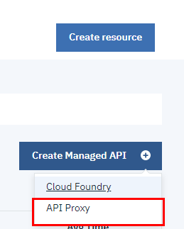
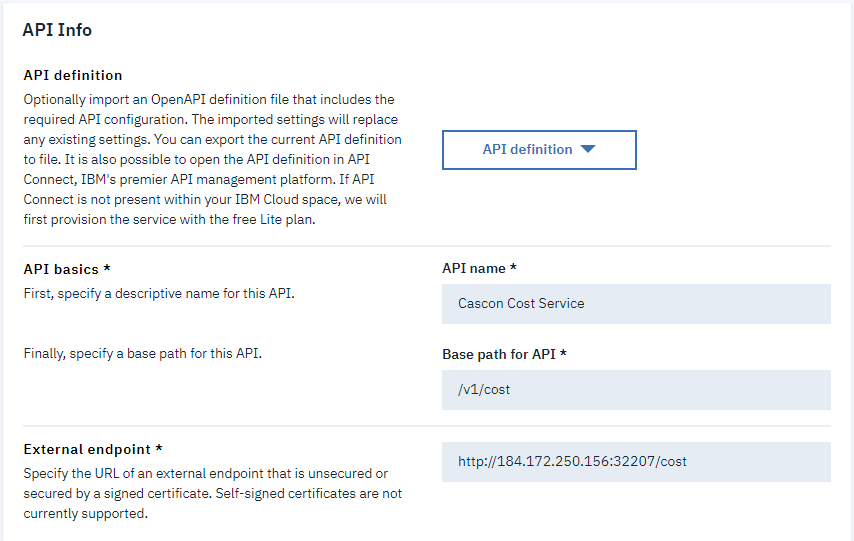

# API Management

This lab will be split into multiple parts.

[Securing your API with Calico](04b-securing-with-calico.md)

[Improving the API Management Security](04d-improving-apim-security.md)

[Configuring the other end points](04e-configuring-other-end-points.md)

## Summary of previous steps

So far, we have created services, deployed them to a kubernetes cluster and we have exposed them via a NodePort which assigns a random port to the service.

In this part of the workshop, we will use the IBM Cloud API Management to secure the cost service so that we can eventually control who has access and impose API limits to the calls to that service.  The same techniques could be applied to any service which is exposed with a NodePort.

### Pre-requisites

In order to be able to configure API management you will need some pieces of information about your cluster. Run the two commands below.

```
kubectl get nodes -o wide
kubectl get services -o wide
```

The first one will allow you to find your External IP address for your cluster.

The second will allow you to see which port your NodePort is configured for,

Sample output: 
```
$ kubectl get nodes -o wide
NAME            STATUS   ROLES    AGE   VERSION       INTERNAL-IP     EXTERNAL-IP      OS-IMAGE             KERNEL-VERSION      CONTAINER-RUNTIME
10.80.171.159   Ready    <none>   15d   v1.14.6+IKS   10.80.171.159   173.197.99.247   Ubuntu 16.04.6 LTS   4.4.0-161-generic   containerd://1.2.9

$ kubectl get services -o wide
NAME                  TYPE        CLUSTER-IP       EXTERNAL-IP   PORT(S)          AGE     SELECTOR
account-service       NodePort    172.25.28.46     <none>        8080:32485/TCP   4d18h   app=dep-account
kubernetes            ClusterIP   172.25.0.1       <none>        443/TCP          15d     <none>
cost-service          NodePort    172.25.126.195   <none>        8082:32482/TCP   4d18h   app=dep-cost
provider-service      NodePort    172.25.240.212   <none>        8081:31694/TCP   4d18h   app=dep-provider

```

So for our example, the cost service is exposed with:
- External IP: 173.197.99.247
- Port: 32482

### Testing our service using curl

We should be able to access our cost service (redirect message) using *curl* (or Postman)
```
curl http://173.197.99.247:32482
```

Sample output:
```
$ curl http://173.197.99.247:32482
  % Total    % Received % Xferd  Average Speed   Time    Time     Time  Current
                                 Dload  Upload   Total   Spent    Left  Speed
100    27  100    27    0     0    245      0 --:--:-- --:--:-- --:--:--   245Found. Redirecting to /cost

```

### Accessing API management

**Note:** If you are using a Mac, do not use Safari as the browser as it seems to have issues and does not allow all the steps to be completed fully.

In your IBM Cloud account, 
- Top left menu, then select *API Management*

- Then in the left menu select *Managed APIs*

- On the right click the blue button *Create Managed API* and select the *API Proxy* option.  An API proxy is a simple reverse proxy which creates a readable URL to point at a backend service.  In our case we're going to point it at the service deployed in Kubernetes.


### Creating your first API proxy

The page that comes up allows you to create an API proxy. The simplest way to achive this is by filling in the information for
- API Name, this is just a user friendly name to identify the API
- Base path for API, this is what you want. Often a version is used, for example `/v1` followed by the name of the endpoint `/cost` for a resulting: `/v1/cost`
- External endpoint, this will be the public IP of your kubernetes cluster with the port used by your NodePort


**Note**: that our apps currently redirect the `/` to `/cost` by default. To avoid this redirect we should specify the end point directly

With those pieces of information filled in, scroll to the bottom and click the blue *Create* button.  For now, you can ignore the Security and Rate Limiting section.

If you go on the *Summary* tab, you will see the Route you have just created.


In our case the route is `https://1883da9e.us-south.apiconnect.appdomain.cloud/v1/cost`

You should now be able to test the new end point:
```bash
curl https://1883da9e.us-south.apiconnect.appdomain.cloud/v1/cost/123
```

Is our API secure? Well.... Not really.  We've created a new URL based endpoint via API Management which we can supply to others to contact the service.  However, the API can still be accessed directly via the IP address if it's known.  This will bypass all the features that API Management is offering.

If you run the following command

`curl http://173.193.99.247:32482`

You can still access the API.

## Next step

We need to secure cluster network access and only allow traffic to contact our service from API Management and not directly.  We will do this in the next lab - [Securing your API with Calico](04b-securing-with-calico.md)
