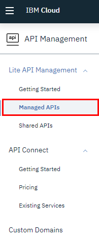

# Lab 4 API Management

So far, we have created services, deployed them to a kubernetes cluster and we have exposed them via a NodePort which assigns a random port to the service.

In this part of the workshop, we will use the IBM Cloud API Management to secure the cost service so that we can eventually control who has access and impose API limits to the calls to that service. The same techniques could be applied to any service which is exposed with a NodePort.

## A. Summary of previous steps

This diagram illustrates our starting point


<details>
<summary>Gather information require for next steps</summary>

In order to be able to configure API management you will need some pieces of information about your cluster. Run the two commands below.

```
kubectl get nodes -o wide
kubectl get services -o wide
```

The first one will allow you to find your External IP address for your cluster.

The second will allow you to see which port your NodePort is configured for,

Sample output: 
```
$ kubectl get nodes -o wide
NAME            STATUS   ROLES    AGE   VERSION       INTERNAL-IP     EXTERNAL-IP      OS-IMAGE             KERNEL-VERSION      CONTAINER-RUNTIME
10.80.171.159   Ready    <none>   15d   v1.14.6+IKS   10.80.171.159   173.197.99.247   Ubuntu 16.04.6 LTS   4.4.0-161-generic   containerd://1.2.9

$ kubectl get services -o wide
NAME                  TYPE        CLUSTER-IP       EXTERNAL-IP   PORT(S)          AGE     SELECTOR
account-service       NodePort    172.25.28.46     <none>        8080:32485/TCP   4d18h   app=dep-account
kubernetes            ClusterIP   172.25.0.1       <none>        443/TCP          15d     <none>
cost-service          NodePort    172.25.126.195   <none>        8082:32482/TCP   4d18h   app=dep-cost
provider-service      NodePort    172.25.240.212   <none>        8081:31694/TCP   4d18h   app=dep-provider

```

So for our example, the cost service is exposed with:
- External IP: 173.197.99.247
- Port: 32482

### Testing our service using curl

We should be able to access our cost service (redirect message) using *curl* (or Postman)
```
curl http://173.197.99.247:32482
```

Sample output:
```
$ curl http://173.197.99.247:32482
  % Total    % Received % Xferd  Average Speed   Time    Time     Time  Current
                                 Dload  Upload   Total   Spent    Left  Speed
100    27  100    27    0     0    245      0 --:--:-- --:--:-- --:--:--   245Found. Redirecting to /cost

```

</details>

## B. Accessing API Management

Our goal is to start using the API Management to secure our API from being used without permission.


<details>
<summary>Instructions to configure API Management</summary>

**Note:** If you are using a Mac, do not use Safari as the browser as it seems to have issues and does not allow all the steps to be completed fully.

In your IBM Cloud account, 

1. Expand the menu from the top left icon. Select __API Management__.


2. From the left menu select __Managed APIs__



Note: If you are accessing this for the first time, you may encounter the following error. 


If so, select:
  * `Dallas` from the *REGION* dropdown
  * your id under the *CLOUD FOUNDRY ORG* dropdown
  * `dev` under *CLOUD FOUNDRY SPACE*

This should take you to the main API Management page.

3. Click the blue `Create Managed API` button and select the __API Proxy__ option. An API proxy is a simple reverse proxy which creates a readable URL to point at a backend service. In our case, we're going to point it at the service deployed in Kubernetes.


### Creating your first API proxy

The page that comes up allows you to create an API proxy. The simplest way to achive this is by filling in the information for
- API Name, this is just a user friendly name to identify the API
- Base path for API, this is what you want. Often a version is used, for example `/v1` followed by the name of the endpoint `/cost` for a resulting: `/v1/cost`
- External endpoint, this will be the public IP of your kubernetes cluster with the port used by your NodePort


**Note**: that our apps currently redirect the `/` to `/cost` by default. To avoid this redirect we should specify the end point directly

With those pieces of information filled in, scroll to the bottom and click the blue *Create* button. For now, you can ignore the Security and Rate Limiting section.

If you go on the *Summary* tab, you will see the Route you have just created.


In our case the route is `https://1883da9e.us-south.apiconnect.appdomain.cloud/v1/cost`

You should now be able to test the new end point:
```bash
curl https://1883da9e.us-south.apiconnect.appdomain.cloud/v1/cost/123
```

</details>

<details>
<summary>Is our API secure?</summary>
 Well.... Not really. We've created a new URL based endpoint via API Management which we can supply to others to contact the service. However, the API can still be accessed directly via the IP address if it's known. This will bypass all the features that API Management is offering.

If you run the following command

`curl http://173.193.99.247:32482`

You can still access the API.


</details>

## C. Securing your API with Calico

We need to secure cluster network access and only allow traffic to contact our service from API Management and not directly. 

<details>
<summary>Securing the App With Calico</summary>


In the previous steps, we started securing our API, but realized that someone who finds the public ip and port of our cluster would still be able to access the API by bypassing our API Management. When using Kubernetes clusters we can protect our cluster by using some plugins.

In this case we will be using a plugin called Calico to enable some networking policies.

### Installing Calico

Calico enables networking and network policy in Kubernetes clusters. In IBM Cloud, Calico is pre-installed which allows us to configure network policies in our cluster. But before we do that, we need to install the Calico command line interface (CLI).

If you have not already installed the Calico CLI as part of the Setup Lab then go to the following URL and follow the instructions to install Calico CLI

https://cloud.ibm.com/docs/containers?topic=containers-network_policies#cli_install

**Note:** if you are using a Windows machine, you will need to add the `--config=calicoctl.cfg` option to all the command lines in this lab. It is easier if you copy the configuration file to your current directory to achieve this.

### Configuring Calico Network policies

### Blocking all incoming traffic on the open ports

The first step we want to take is to block all traffic going to the cluster so that services are no longer accessible.

We achieve this by using a *Global Network Policy* to deny access:
```yaml
 apiVersion: projectcalico.org/v3
 kind: GlobalNetworkPolicy
 metadata:
   name: deny-nodeports
 spec:
   applyOnForward: true
   preDNAT: true
   ingress:
   - action: Deny
     destination:
       ports:
       - 30000:32767
     protocol: TCP
     source: {}
   - action: Deny
     destination:
       ports:
       - 30000:32767
     protocol: UDP
     source: {}
   selector: ibm.role=='worker_public'
   order: 1100
   types:
   - Ingress
```

As you may see in the above policy:
- We deny all incoming TCP traffic on ports 30000 to 32767
- We deny all incoming UDP traffic on ports 30000 to 32767

You can find this policy in a file called `deny-nodeports.yaml` in the repository. Navigate to the cascon-2019-kubernetes-apimanager/04-api-management directory on your computer which you cloned from GitHub in the previous labs.

Run the command: 

    calicoctl apply -f deny-nodeports.yaml
    
You should get confirmation that the policy was applied.

Now try connecting to your service using the curl command again. It now will not connect due to the network policy.

We now have the following configuration:


### Accepting incoming connections using a whitelist

Now that all traffic going to those ports has been blocked our API is secured, but also is unusable by anyone.

For testing purposes we will want to open up access to our IP address. Open the file whitelist.yaml and update the IP address to be your external IP address. You can obtain this IP (my_ip_address) from the command:

    curl https://ifconfig.me
    
The external node IP (node_ip) can be determined by: 

    kubectl get nodes -o=jsonpath='{.items[0].status.addresses[?(@.type=="ExternalIP")].address}'

The nodeport (nodeport_port) of your cost service is found at:

    kubectl get service cost-service

This is the whitelist.yaml file:

```yaml
 apiVersion: projectcalico.org/v3
 kind: GlobalNetworkPolicy
 metadata:
   name: whitelist
 spec:
   applyOnForward: true
   preDNAT: true
   ingress:
   - action: Allow
     destination:
       nets:
       - <node_ip>/32
       ports:
       - <nodeport_port>
     protocol: TCP
     source:
       nets:
       - <my_ip_address>/32
   selector: ibm.role=='worker_public'
   order: 500
   types:
   - Ingress
```

Save the file.

As you may see above the policy:
- Allows for incoming connections coming from *your* IP
- Allows connections going specifically to the cluster public_ip and nodeport port for the service you want to expose

Run the command: 

    calicoctl apply -f whitelist.yaml
    
You should get confirmation that the policy was applied.

Try accessing your service again using the command we used before and the direct IP address - the connection should work. Ask a friend to try to connect and the connection should fail.

Obviously this is not achieving what we ultimately want yet because we are only allowing traffic from our own computer. 

If you try to connect using the API Management URL we received in the previous step, that connection should still fail.

### Updating our policy to allow connections from the API Management IPs

The API Management actually uses multiple IP addresses to connect to the service, so we need to add all of them to our whitelist. Open up the whitelist.yaml file again and add these entries:

  - 169.46.16.165/32
  - 169.46.27.162/32
  - 169.46.64.77/32
  - 169.48.97.211/32
  - 169.48.97.212/32
  - 169.48.246.130/32
  - 169.48.246.131/32
  - 169.60.186.186/32

```yaml
 apiVersion: projectcalico.org/v3
 kind: GlobalNetworkPolicy
 metadata:
   name: whitelist
 spec:
   applyOnForward: true
   preDNAT: true
   ingress:
   - action: Allow
     destination:
       nets:
       - <cluster_public_ip>/32
       ports:
       - <nodeport_port>
     protocol: TCP
     source:
       nets:
       - 169.46.16.165/32
       - 169.46.27.162/32
       - 169.46.64.77/32
       - 169.48.97.211/32
       - 169.48.97.212/32
       - 169.48.246.130/32
       - 169.48.246.131/32
       - 169.60.186.186/32
       - <my_ip_address>/32
   selector: ibm.role=='worker_public'
   order: 500
   types:
   - Ingress
```

Apply this new whitelist by executing the command `calicoctl apply -f whitelist.yaml`

Now if you try to connect using the API Management URL we received in the previous step that connection should successfully connect to the service.

If you need help finding the IP addresses for API Management, refer to this document: 
[Finding the IP of API Management for Calico](finding-the-ip-of-api-management.md)

### Removing our own IP from the configuration

Now that we have enabled the IPs for the API Management, you should remove your own IP from the whitelist so that all traffic can only come through the API Management link.

We should now have the following configuration:


</details>

## D. Improving the API Management Security

So we now have a microservice that is accessible only via the API management url. We can now turn our focus to improving the security of the API.

<details>
<summary>Enabling Security using API Keys</summary>

Now that our API is accessible via the API Management, we can start enabling some of the security features included.

- Go to the *Definition" tab for the API in API Management
- Scroll to *Security and Rate Limiting*
- On the right, enable the *Require applications to authenticate via API key* option
    - Method: API key only
    - Location of API key and secret: Header
    - Parameter name of API key: X-IBM-Client-Id
- Scroll to the bottom and click *Save*

Back in the terminal if you re-run the curl command for the service you will get an authorization error. Example:
```
curl https://1883da9d.us-south.apiconnect.appdomain.cloud/v1/cost/123
{"status":401,"message":"Error: Unauthorized"}
```

### Creating an API Key

In order to be able to access our API, we now need to create an API Key and start using it.

- In the API Managmement screen for the specific Cost API select the *Sharing & keys* tab
- In the *Sharing Outside of Cloud Foundry organization* section, click the blue button *Create API key*
    - Descriptive name: First API Key
    - API key: *Use generated key*

- Click the blue *Create* button


### Calling the API using the API Key

You now have an API key that you can use when calling the service. As per the configurations selected in previous steps, this API key needs to be added to the header

The curl command would look something like: 

`curl https://1883da9e.us-south.apiconnect.appdomain.cloud/v1/cost -H "X-IBM-Client-Id: <API_KEY>"`

Great! our API call worked!

The Lite API Management feature in IBM Cloud allows up to 5 keys to be added per API. These could be used to offer integration access to your API to different users or applications.

### Discussion on API Key and Secret

A secret is similar to a key, as is used to maintain access to the API itself. A secret is customizable and can be changed without changing the key. There cannot be a secret if there is no key. For example, only someone with the correct secret can upload a new version of the API. You can require an API and a secret for your API calls or only use a key. Secrets can be helpful if you need to change the secret, but do not want to change the key.

From: https://cloud.ibm.com/docs/services/api-management?topic=api-management-manage_apis

</details>


## E. Rate Limiting

Depending on your specific use case, you may need to limit the number of calls coming through to your API.
- Your clients only paid for a specific number of calls per period of time
- Your infrastructure can only support X calls per second before seeing performance degradation

<details>
<summary>Enabling rate limiting</summary>

This is what you need to do to enable rate limiting

- On the *Definition* tab, scroll to the *Rate limiting* section
- Enable the *Limit API call rate on a per-key basis*
  - Maximum calls: 5
  - Unit of time: Minute
- Scroll to the bottom and click *Save*


Now if you execute the command:
`curl https://1883da9e.us-south.apiconnect.appdomain.cloud/v1 -H "X-IBM-Client-Id: <API_KEY>"`

it will work for the first 5 calls, but will respond with a 
```
{"status":429,"message":"Error: Rate limit exceeded"}
```
error once you have exceeded the number of calls in that particular minute.

Of course this configuration is mostly for demonstration purposes and you would want to configure it to your specific requirements. Rate limiting can apply differently to different API's and also to different keys. So you could limit certain API's and specific keys at a higher or lower rate.

</details>

## F. Configuring the other end points

So far we have worked with a single service, the *cost* service. In practice you will likely want to configure multiple endpoints, possibly with different API Keys or rate limits for each end point.

<details>
<summary>Enabling API Management for account and provider services</summary>

We have 2 other services that we can also configure, the *account* and the *provider* services.

### Configuring the account and provider services

For both of these you will want to repeat the steps from the [First part of the lab](Readme.md), specifically the section **Creating your first API proxy**. Of course you will need to adjust the endpoints accordingly.

You will then also have to update your `whitelist.yaml` file to include the additional 2 ports required for these services.

Your `whitelist.yaml` should look like:
```yaml
 apiVersion: projectcalico.org/v3
 kind: GlobalNetworkPolicy
 metadata:
   name: whitelist
 spec:
   applyOnForward: true
   preDNAT: true
   ingress:
   - action: Allow
     destination:
       nets:
       - <cluster_public_ip>/32
       ports:
       - <port for cost service>
       - <port for account service>
       - <port for provider service>
     protocol: TCP
     source:
       nets:
       - 169.46.16.165/32
       - 169.46.27.162/32
       - 169.46.64.77/32
       - 169.48.97.211/32
       - 169.48.97.212/32
       - 169.48.246.130/32
       - 169.48.246.131/32
       - 169.60.186.186/32
       - <my_ip_address>/32
   selector: ibm.role=='worker_public'
   order: 500
   types:
   - Ingress
```
Apply the new whitelist using the command `calicoctl apply -f whitelist.yaml`

You should now be able to test the new end points:
```
curl https://1883da9e.us-south.apiconnect.appdomain.cloud/v1/account
curl https://1883da9e.us-south.apiconnect.appdomain.cloud/v1/provider
```
Note that at the moment only the cost service requires an API key.

If you provide some additional information on the path of the url you will receive specific information:
```bash
$ curl https://1883da9d.us-south.apiconnect.appdomain.cloud/v1/account/123
  % Total    % Received % Xferd  Average Speed   Time    Time     Time  Current
                                 Dload  Upload   Total   Spent    Left  Speed
100   100  100   100    0     0    163      0 --:--:-- --:--:-- --:--:--   163{"account_id":"123","name":"Mary Walters","address":"819 Walters Ave","providers":["bell","rogers"]}

$ curl https://1883da9d.us-south.apiconnect.appdomain.cloud/v1/provider/bell
  % Total    % Received % Xferd  Average Speed   Time    Time     Time  Current
                                 Dload  Upload   Total   Spent    Left  Speed
100    44  100    44    0     0    100      0 --:--:-- --:--:-- --:--:--   100{"provider_id":"bell","cost":15.99,"term":2}

```
</details>

### Next level of configuration

<details>
<summary>Experimenting with API Management features</summary>
Here, take some time on your own to configure the API's in different ways. In addition to being able to add an API Key as we did in the cost service, we can experiment with:
- configuring some of the API's with API keys and some without
- Having a different Rate Limits per API
- Using API Keys and Secret: https://cloud.ibm.com/docs/services/api-management?topic=api-management-keys_secrets

</details>

## G. API Logging

Lastly, the API Managememt interface also allows you to view some logs of API usage. On the Summary tab for the API you can view the number of calls to the API, the average response time and even individual API responses. This is a handy tool to determine usage.

